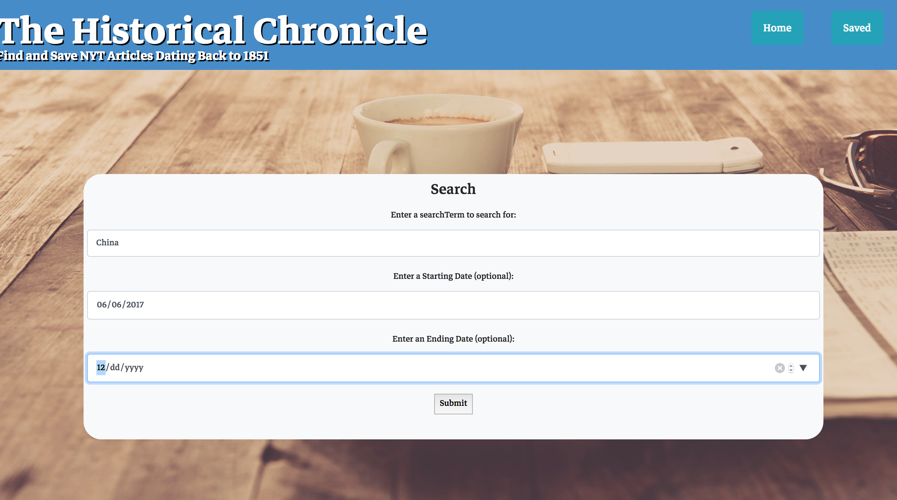

# React.JS NYTimes Historical Article Search Engine

In this full stack application, built with `NodeJS`, `MongoDB`, `Express`, and `ReactJS`, users can search for articles on any topic within any specified date range.  The user may browse articles and save them to a personal list as they wish.  The application's intent is to provide a useful interface for students whos research requires gathering historical articles.  

Click [here](https://sheltered-lowlands-45694.herokuapp.com/) to try the application on Heroku!

## Technology
On the backend, this application uutilzes an `Express` server to serve API routes and `Mongoose` to interact with a `MongoDB` NoSQL database.

On the frontend, the app uses `ReactJS` for rendering components and site routing, `Axios` for internal and external API calls, `Bootstrap` as a CSS library, and `Yarn` as a package manager and task runner.  In order to transpile the JSX code, `Webpack` and `Babel` were utilized. 

## Install Locally
  1. Ensure that you have MongoDB installed on your machine.
  2. Once MongoDB is installed locally, open a bash or terminal window and run `mongod`.
  3. Clone this repo in your terminal or bash window
  4. In terminal or bash, run `cd nytReactApp` followed by `yarn install`.
  5. In terminal or bash, run `cd client` followed by `yarn install`.
  6. In termional or bash, run `cd ..` followed by `yarn start`.
  7. This will boot the server on port 3001 on your local machine and the application on port 3000.
  8. Navigate to `localhost:3000` in your browser.

## Screenshots
#### Users are able to submit a topic, optional start year, and optional end year to query the New York Times articles API.  The historicl record goes back to 1851.

#### Once articles are returned, they are populated to the interface 10 articles at a time.  To read the original article, click Read to open in a new tab.  To save to your personal list, click save.

#### To load more content, click the button at the bottom of the resuls to return the next 10 articles on the topic.  The prior search is saved in the state to make this possible.

#### On the saved page, users may read the article once more or press delete to remove it from their saved list.

#### The routes include **internal routes** to /api for querying and displaying saved articles in the MongoDB and **external routes** for querying the NYTimes article search API.
